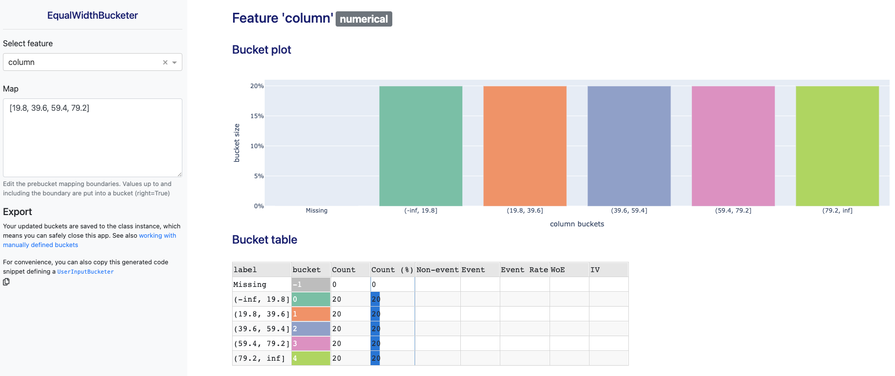

# skorecard

<!--  -->


[](#)
[](https://github.com/psf/black)
[](https://github.com/pre-commit/pre-commit)

`skorecard` is a scikit-learn compatible python package that helps streamline the development of credit risk acceptance models (scorecards).

Scorecards are ‘traditional’ models used by banks in the credit decision process. Internally, scorecards are Logistic Regressions models that make use of features that are binned into different groups. The process of binning is usually done manually by experts, and `skorecard` provides tools to makes this process easier. `skorecard` is built on top of [scikit-learn](https://pypi.org/project/scikit-learn/) as well as other excellent open source projects like [optbinning](https://pypi.org/project/optbinning/), [dash](https://pypi.org/project/dash/) and [plotly](https://pypi.org/project/plotly/).

## Features ⭐

- Automate bucketing of features inside scikit-learn pipelines.
- Dash webapp to help manually tweak bucketing of features with business knowledge
- Extension to `sklearn.linear_model.LogisticRegression` that is also able to report p-values
- Plots and reports to speed up analysis and writing technical documentation.

## Quick demo

`skorecard` offers a range of [bucketers](https://ing-bank.github.io/skorecard/api/bucketers/OptimalBucketer/):

```python
import pandas as pd
from skorecard.bucketers import EqualWidthBucketer

df = pd.DataFrame({'column' : range(100)})

ewb = EqualWidthBucketer(n_bins=5)
ewb.fit_transform(df)

ewb.bucket_table('column')
#>    bucket                       label  Count  Count (%)
#> 0      -1                     Missing    0.0        0.0
#> 1       0                (-inf, 19.8]   20.0       20.0
#> 2       1                (19.8, 39.6]   20.0       20.0
#> 3       2  (39.6, 59.400000000000006]   20.0       20.0
#> 4       3  (59.400000000000006, 79.2]   20.0       20.0
#> 5       4                 (79.2, inf]   20.0       20.0
```

That also support a dash app to explore and update bucket boundaries:

```python
ewb.fit_interactive(df)
#> Dash app running on http://127.0.0.1:8050/
```



## Installation

```shell
pip3 install skorecard
```

## Documentation

See [ing-bank.github.io/skorecard/](https://ing-bank.github.io/skorecard/).

## Presentations

| Title                                              | Host                    | Date         | Speaker(s)                                   |
|----------------------------------------------------|-------------------------|--------------|----------------------------------------------|
| Skorecard: Making logistic regressions great again | [ING Data Science Meetup](https://www.youtube.com/watch?v=UR_1XZxEuCw) | 10 June 2021 | Daniel Timbrell, Sandro Bjelogrlic, Tim Vink |
